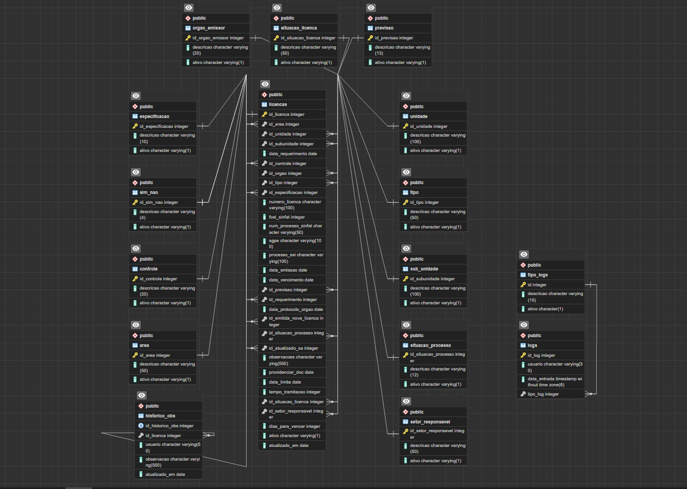

# Gestão de licenças ambientais
Essa API tem o propósito de gerenciar licenças ambientais para o setor de Qualidade e Meio Ambiente da Companhia Águas de Joinville. Os cálculos de campos e regras de negócio foram transpostos de fórmulas de macros feitas pela engenharia.

## Funcionalidades principais:
- Consultar, alterar e adicionar licenças.
- Autenticação realizada via servidor LDAP
- Calculo da situação da licença com base no tipo, licenciamento, autorização, requerimento, previsão e entre outros campos.
- Rotina diaria de calculo de todas as tarefas por agendamento
- Historico de observações
- Controle de Logs e de alterações
- Rotas protegidas por token

## Tecnologias
- **Java**
-  **Spring boot**
-  **Postgres**
-  **JWT**

## Diagrama de entidade relacional

